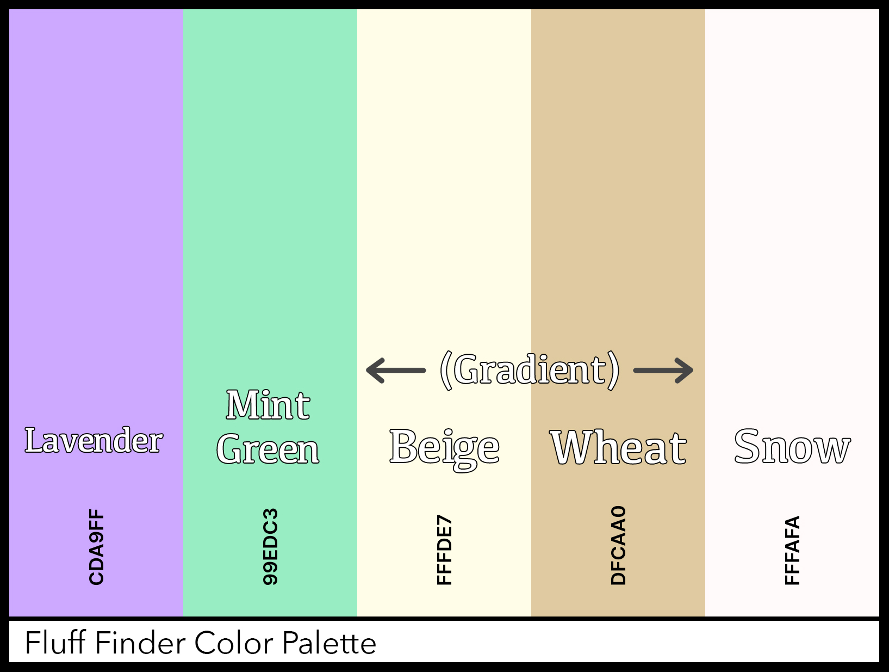

# Fluff Finder
[image]

Live link to demo: [Fluff Finder](https://fluff-finder.netlify.app/)

## Project Summary

### Overview 
Fluff Finder is the perfect website for any pet lovers in Singapore! The site's primary feature is an interactive map, enabling users to discover various pet-friendly locations in Singapore. The website allows for the seamless discovery of any pet-related locales in Singapore: Pet Cafes, Pet Groomers, Pet Supplies Stores, and Dog Parks. By displaying the name and address of each individual location on the map, users can identify locations they would like to learn more about or even travel to with ease. Each location category is also separated via different icons, enabling easy differentiation between the various locations the map displays.

The site also features a relaxing second page where users can enjoy randomly-generated images of dogs!

### Target Audience & User Goals

All in all, the main goal of the website is to assist Singaporeans in finding any relevant locations for their pets. This website will be useful for any dog & cat owners in Singapore, as many animal-friendly locations fly under the radar and can be quite difficult to pinpoint. As an example, it is relatively common for dog owners to ask online groups about where they can discover new and fun dog-friendly locations, especially dog cafés. Generally, no one memorizes a list of every single mall that allows dogs. Sometimes, you just want to go for a nice outing and enjoy the company of your pet, but limited information makes this task a bit more difficult.

Fluff Finder enables easy and near-instantaneous access to crucial information - such as names and addresses - about any relevant areas & services pet owners might require. Ultimately, this saves users time and hassle, enriching the overall experience for all pet owners and their fluffy friends!

## UI/UX Elements

### Structure
(wireframe... hmm...)

### Design Decisions

#### Color Scheme

The main color scheme of the project revolves around a light background (a beige-wheat gradient), with a lavender accent for the header. The items within the main content box are backed by a smooth snowy base. These light colors evoke a sense of calm and tranquility, while maintaining an elegant touch. Light colors are also easy on the eyes, avoiding any jarring effects and creating an affable atmosphere. The lavender color also represents a sense of elegance and sophistication. Mint green highlighting is also used to directly complement the lavender header color. All in all, these colors come together to present the website in a professional yet friendly manner.

#### Fonts

- *Play* is a minimalistic typeface that has been designed to appear both square and circular at the same time. Each letter derives from the letter 'O' - which allows for a sense of balance and interconnectedness. This was chosen as the primary font of the website, allowing for a friendly and sleek overall appearance for the user, with the text being very legible and easy on the eyes.
- *Unbounded* was selected as the font for the main Fluff Finder header on the website. While it is a bold and courageous font in its own right, it's also capable of accounting for hundreds of languages worldwide, as well as countless symbols and glyphs. This resultantly gives the header a strong and stylish appearance, while retaining its universality. 
- *Carter One* is a font that reimagines popular typeforms from the mid-20th century. As it was frequently found in advertising and book covers, it enables text to have a bold, distinct appearance. It was chosen as the font for the navigation bar elements, distinguishing them from the other text elements on the page and helping them stand out.

All in all, the selected fonts are directly in-line with the goal of making the website very warm and friendly to the user, while maintaining a clean and professional feeling.

---

## Features
(list all the specific features of your website out, ex. 
- search for dog park / pharmacy / etc.
- display information of the search result based on marker interaction)

---

## Limitations and Future Implementations
(what doesn't the project address)
- image height isn't static
- jb 
- mp4
- NO GEOLPOCATION
- COMPLETE REST OF MY PAGES

---

## Technologies Used

1. HTML

2. CSS

3. [Bootstrap 5](https://getbootstrap.com/docs/5.0/getting-started/introduction/)
  - Was used for many of the main website components, including the navbar, forms, buttons, and offcanvas functionality. Was also utilized to implement mobile-responsiveness.

4. JavaScript

5. [Axios](https://github.com/axios/axios)
  - Used for fetching relevant data from APIs to be processed for the website

6. [LeafletJS](https://leafletjs.com/)
  - Used for creating and rendering the interactive map on the website

7. [Leaflet Marker Cluster](https://github.com/Leaflet/Leaflet.markercluster)
  - Used for grouping markers on the map into clusters

--- 

## Testing
(table of test cases)

---

## Deployment
The web application is hosted on and was deployed through [Netlify](https://www.netlify.com/).

---

## Credits and Acknowledgment
(credit all external assets here. ex. fonts, icons, data (where you got the API from, ex. FourSquare), screenshot tool to create mockup)

#### Custom Fonts from Google Fonts

[Play](https://fonts.google.com/specimen/Play)

[Unbounded](https://fonts.google.com/specimen/Unbounded)

[Carter One](https://fonts.google.com/specimen/Carter+One)